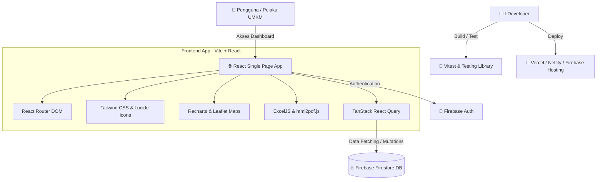
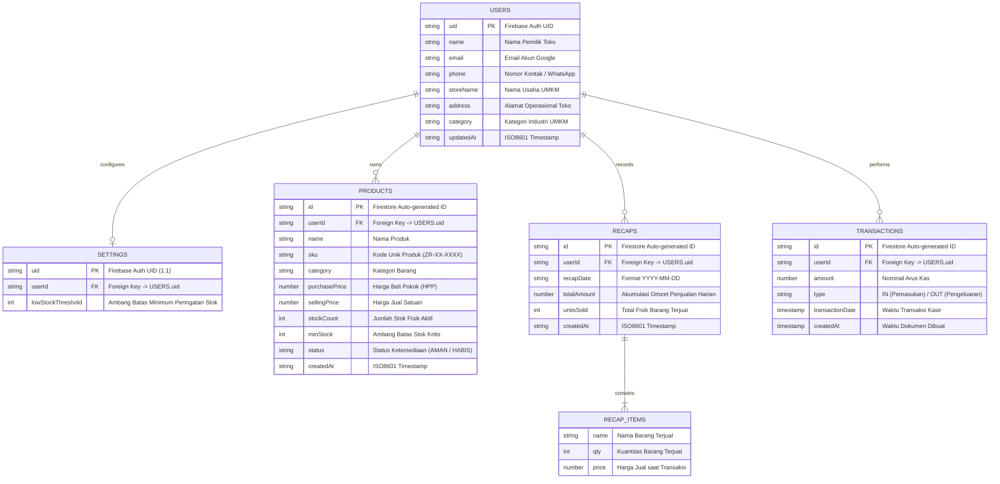

<div align="center">
  
  # ZURA
  ### ulti-Channel Retail & Inventory Management Platform Powered by Event-Driven Sync & AI Copilot

  
  [](https://videotourl.com/videos/1788624760922-0b0c15ae-2000-4e4b-a202-265c4f842baf.mp4)
  [](https://github.com/Mie-Yamin/Zura-UMKM.git)
  [](LICENSE)
  
  **Submission for ITECHNO CUP 2026 - Web Development**
  
  **By CARIIN NAMA TIM YG ANOMALI DONG**
  
</div>

---

## 📋 Daftar Isi

- [Tim Developer](#-tim-pengembang)
- [Tentang Proyek](#-tentang-proyek)
- [Fitur Unggulan](#-fitur-unggulan)
- [Demo & Screenshot](#-demo--screenshot)
- [Teknologi](#-teknologi)
- [Arsitektur Sistem](#-arsitektur-sistem)
- [Instalasi & Setup](#-instalasi--setup)
- [Penggunaan](#-penggunaan)
- [API Documentation](#-api-documentation)
- [Testing](#-testing)
- [Lisensi](#-lisensi)

---

## 👥 Tim Developer

| Nama | Peran | GitHub |
|------|-------|--------|
| **Nahla Chika Khumaira** | Frontend Developer | [@porvyyn](https://github.com/porvyyn) |
| **Naurah Salsabila** | Backend Developer | [@Mie-Yamin](https://github.com/Mie-Yamin) |
| **Ammar Daffa Ilyasa** | UI/UX Designer | [@ammaroff338-boop](https://github.com/ammaroff338-boop) |

---

## 🎯 Tentang Proyek

### Latar Belakang
Berdasarkan data Kementerian Koperasi dan UKM, Indonesia memiliki lebih dari 64 juta pelaku UMKM. Namun, banyak dari mereka mengalami kendala operasional saat berjualan secara **multi-channel** (Shopee, Tokopedia, TikTok Shop, dan Toko Fisik/Bazar). 

Beberapa kendala utama yang sering dihadapi UMKM meliputi:
1. **Overselling & Stok Mati (*Deadstock*)**: Ketidakselarasan stok antara toko fisik dan *marketplace* yang menyebabkan pembatalan pesanan konsumen secara sepihak.
2. **Rekap Manual yang Menguras Waktu**: Pelaku usaha menghabiskan waktu bertajak-tajak setiap malam hanya untuk mencocokkan laporan transaksi Excel/CSV dari berbagai saluran penjual.
3. **Format Laporan Berbeda-beda**: Format *export* laporan dari masing-masing *marketplace* tidak seragam, membingungkan pencatatan HPP dan Laba Rugi.

### Solusi yang Ditawarkan
**Zura (UMKM Pulse)** hadir sebagai platform manajemen ritel terintegrasi yang menyelesaikan masalah operasional UMKM melalui 3 pilar inovasi:
- ⚡ **Event-Driven Webhook Real-Time Sync**: Setiap ada transaksi masuk di *marketplace*, stok di pusat otomatis terpotong detik itu juga.
- 🧠 **Smart Column Auto-Mapping & Preview**: Membaca laporan CSV/Excel ekspor *marketplace* dengan nama kolom apa pun tanpa perlu *formatting* manual.
- 🤖 **Zura AI Copilot (xAI Grok Engine)**: Asisten bisnis cerdas berbasis AI yang memberikan analisis krisis stok, omset, dan saran aksi bisnis secara *real-time*.

### Tujuan Proyek
- 🎯 **Tujuan Utama**: Menyediakan sistem inventaris dan rekap penjualan multi-saluran terpusat yang responsif, cepat, dan mudah digunakan oleh UMKM skala mikro hingga menengah.
- 📊 **Target Pengguna**: Pemilik Usaha Kecil Menengah (UMKM Ritel, F&B, Fashion, dan Sembako) yang berjualan di *online marketplace* maupun toko fisik.
- 💡 **Value Proposition**: Bebas penataan ulang format Excel, sinkronisasi otomatis multi-saluran, dan analisis cerdas AI Copilot berdesain ramah seluler (*mobile-first*).

---

## ✨ Fitur Unggulan

### Fitur Utama

| Fitur | Deskripsi | Keunggulan |
|-------|-----------|------------|
| ⚡ **Simulasi Webhook Event-Driven** | Menguji sinkronisasi pesanan dari Shopee, TikTok Shop, dan Tokopedia secara *real-time*. | Stok fisik di pusat otomatis terpotong instan tanpa perlu transaksi *marketplace* sungguhan saat demo. |
| 📊 **Impor Excel & Smart Column Mapper** | Membaca laporan transaksi Excel/CSV dengan fitur deteksi header dan *custom column mapping*. | Pengguna bebas dari format tabel kaku. Bebas mengunggah nama header apa saja (*Barang*, *Qty*, *Harga Satuan*). |
| 🤖 **Zura AI Copilot (xAI Grok Engine)** | Asisten AI interaktif yang terhubung ke database Firestore untuk menjawab pertanyaan bisnis. | Memberikan analisis kontekstual riil berdasarkan stok kritis dan total omset toko pengguna. |
| 📦 **Manajemen Stok & Mode HPP Grosir** | Kalkulator otomatis HPP per pcs berdasarkan pembelian harga modal dus/grosir. | Mempermudah penentuan harga jual dan mendeteksi stok kritis/menipis secara presisi. |

### Fitur Tambahan

- 🔄 **SOP Checklist Operasional Harian**: Daftar tugas rutinitas toko harian yang dapat di-reset, disesuaikan, atau menggunakan *preset template* (Online/F&B).
- 🏷️ **Custom Saluran & Kategori Usaha**: Pencatatan dinamis untuk saluran jualan custom (WhatsApp, Bazar, Lazada) dan kategori produk kustom.
- 📱 **Mobile-First Responsive Design**: Tampilan antarmuka khusus seluler (Card Stack, Flex Layout) yang nyaman diakses melalui smartphone.
- 🛡️ **Pengaturan Keamanan Akun & Re-authentication**: Sistem autentikasi Firebase yang aman untuk pembaruan email, kata sandi, dan penghapusan akun.

---
## 📸 Demo & Screenshot

### Live Demo

🔗 **[Tonton Video](https://videotourl.com/videos/1788624760922-0b0c15ae-2000-4e4b-a202-265c4f842baf.mp4)**

### Screenshot Aplikasi

<div align="center">
  
  <p><em>Homepage - Tampilan utama aplikasi</em></p>
  
  
  <p><em>Dashboard - Panel kontrol pengguna</em></p>
  
  
  <p><em>Menu - Kumpulan Fitur</em></p>
</div>


## 🛠️ Teknologi

### Tech Stack

#### Frontend
```
Framework    : React (v18) + Vite
UI Library   : Tailwind CSS (dengan Lucide React untuk ikon & Leaflet/Recharts untuk peta & grafik)
State Mgmt   : TanStack Query (React Query v5)
Validation   : -
```

#### Backend
```
Runtime      : - (Client-Side / BaaS)
Framework    : Firebase SDK
Database     : Firebase Firestore / Realtime Database
ORM / Client : Firebase Web SDK (v12)
Auth         : Firebase Authentication
30
```

#### DevOps & Tools
```
Deployment   : Vercel / Firebase Hosting / Netlify (opsional)
CI/CD        : -
Testing      : Vitest + Testing Library + jsdom + Fast-Check + Vitest-Axe
Monitoring   : -
```

### Alasan Pemilihan Teknologi

| Teknologi | Alasan Pemilihan |
|-----------|------------------|
| **React + Vite** | Kombinasi *library* UI dan *build tool* generasi baru yang memberikan performa pengembangan sangat cepat (*instant HMR*) serta hasil *bundle* produksi yang teroptimasi. |
| **Firebase** | Solusi *Backend-as-a-Service* (BaaS) *serverless* untuk mengelola autentikasi dan basis data secara *real-time* tanpa perlu membangun infrastruktur server backend dari nol. |
| **Tailwind CSS** | Framework CSS *utility-first* yang mempercepat pembuatan antarmuka responsif, konsisten, dan mudah dikustomisasi langsung pada markup komponen. |
| **TanStack Query** | Efisiensi pengelolaan *state* asinkron dan data *fetching* dengan fitur *caching* otomatis, penanganan *loading/error*, serta sinkronisasi data yang lancar. |
| **Vitest & Testing Library** | Ekosistem pengujian modern yang terintegrasi secara cepat dengan Vite, mendukung pengujian unit, interaksi UI, hingga tes aksesibilitas (*a11y*). |

### Dependencies Utama

```json
{
  "dependencies": {
    "@tanstack/react-query": "^5.0.0",
    "@types/leaflet": "^1.9.22",
    "exceljs": "^4.4.0",
    "firebase": "^12.18.0",
    "html2pdf.js": "^0.14.0",
    "leaflet": "^1.9.4",
    "lucide-react": "^1.31.0",
    "react": "^18.3.1",
    "react-dom": "^18.3.1",
    "react-router-dom": "^6.26.0",
    "recharts": "^2.12.7",
    "xlsx": "^0.18.5"
  }
}
```

---

## 🏗️ Arsitektur Sistem


### System Architecture


### Database Schema



### Folder Structure
```
├── api/                # Serverless functions
├── public/             # Asset statis (gambar, favicon, font)
├── src/
│   ├── api/            # Service pemanggil API dari frontend
│   ├── components/     # Komponen UI reusable (Button, Modal, Card)
│   ├── config/         # Konfigurasi aplikasi & konstanta global
│   ├── hooks/          # Custom React Hooks
│   ├── mocks/          # Mock data untuk testing/development
│   ├── pages/          # Halaman aplikasi (Routing)
│   ├── styles/         # Styling global 
│   ├── test/           # File & helper testing
│   ├── types/          # Tipe data TypeScript (Interfaces/Types)
│   └── utils/          # Fungsi helper (format tanggal, angka, dll)
```

---

## ⚙️ Instalasi & Setup

### Prerequisites

Pastikan Anda telah menginstall:
- **Node.js** (v18.x atau lebih tinggi)
- **npm** atau **pnpm**
- **Git**

### Langkah Instalasi

#### 1️⃣ Clone Repository

```bash
git clone [https://github.com/Mie-Yamin/Zura-UMKM.git](https://github.com/Mie-Yamin/Zura-UMKM.git)
cd Zura-UMKM
```
#### 2️⃣ Install Dependencies

```bash
# Menggunakan npm
npm install
```
#### 3️⃣ Setup Environment Variables

Buat file `.env` di root directory:

```env
VITE_FIREBASE_API_KEY="your_api_key"
VITE_FIREBASE_AUTH_DOMAIN="your_auth_domain"
VITE_FIREBASE_PROJECT_ID="your_project_id"
VITE_FIREBASE_STORAGE_BUCKET="your_storage_bucket"
VITE_FIREBASE_MESSAGING_SENDER_ID="your_messaging_sender_id"
VITE_FIREBASE_APP_ID="your_app_id"
VITE_GROK_API_KEY="your_api_key"
```

#### 4️⃣ Setup Database

```bash
# Firebase Firestore berbasis NoSQL Cloud Service.
# Terapkan aturan keamanan (Security Rules) dan indeks melalui Firebase Console (jika ada).
```

#### 5️⃣ Run Development Server

```bash
npm run dev
```

Aplikasi akan berjalan di `http://localhost:3000`

---

## 🚀 Penggunaan

### Menjalankan Aplikasi

```bash
# Development mode
npm run dev

# Production build
npm run build
npm run start

# Run tests
npm run test

# Linting
npm run bulid
```

### User Guide

#### Untuk Admin / Pemilik UMKM

1. **Registrasi & Login**: Akses aplikasi lalu masuk menggunakan akun Admin terverifikasi via Firebase Auth.
2. **Dashboard Visualisasi**: Memantau grafik statistik performa bisnis, angka penjualan, dan analitik usaha secara *real-time* melalui Recharts.
3. **Analisis AI**: Buka modul AI Insight Hub untuk memperoleh rekomendasi bisnis otomatis.
4. **Ekspor Laporan**: Mengunduh rekapan laporan keuangan dan analitik toko ke dalam format Excel (.xlsx) atau PDF.
---

## 📚 API Documentation
Aplikasi ini berjalan secara *Client-Side* dengan memanfaatkan **Firebase Web SDK** untuk autentikasi dan basis data, serta integrasi **Grok API** untuk layanan kecerdasan buatan (AI).

### 1. Firebase Firestore & Auth Services

* **Authentication**: Menggunakan Firebase Auth (`signInWithEmailAndPassword`, `createUserWithEmailAndPassword`, `signOut`).
* **Firestore Collections**:
  * `umkms`: Menyimpan data profil, lokasi, dan informasi bisnis UMKM.
  * `transactions`: Menyimpan data riwayat transaksi dan penjualan.

### 2. External API Integration (Grok API)

* **Base URL**: `https://api.x.ai/v1`
* **Endpoint**: `POST /chat/completions` (Digunakan untuk analisis data / wawasan AI pada dashboard UMKM).

### Example Request (Firestore Data Fetching)

```typescript
import { initializeApp } from "firebase/app";
import { getFirestore, collection, getDocs } from "firebase/firestore";

const firebaseConfig = {
  apiKey: import.meta.env.VITE_FIREBASE_API_KEY,
  projectId: import.meta.env.VITE_FIREBASE_PROJECT_ID,
};

const app = initializeApp(firebaseConfig);
const db = getFirestore(app);

// Mengambil seluruh data UMKM dari Firestore
const querySnapshot = await getDocs(collection(db, "umkms"));
querySnapshot.forEach((doc) => {
  console.log(`${doc.id} =>`, doc.data());
});

```
## 🧪 Testing

### Running Tests

```bash
# Unit tests
npm run test

# Integration tests
npm run test

# Watch mode
npm run test:watch

# Test coverage
npm run test -- --coverage
```

### Test Coverage

```
Statements   : 17.79%
Branches     : 64.6%
Functions    : 42.51%
Lines        : 17.79%

```

---

## 📄 Lisensi

Proyek ini dilisensikan di bawah [MIT License](LICENSE) - lihat file LICENSE untuk detail lebih lanjut.

---

<div align="center">

  **Made with ❤️ by CARIIN NAMA TIM YG ANOMALI DONG for ITECHNO CUP 2026**

  
</div>
